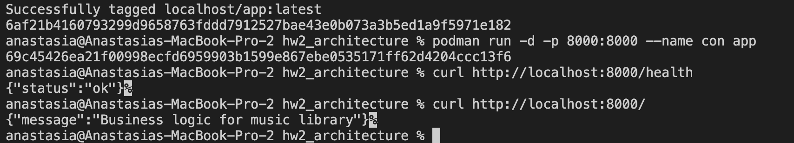

# Homework 3: Containerization with Podman

Author: **Anastasiia Kucheruk**

## 📝 Description

In this homework I used podman to wrap applications into containers and run them.

## 🖥 Usage

### How to run the application

1. Clone the repository
2. Open folder *business*
3. To complete task 1, firstly build the image *podman build -t app .*
4. Then run *podman run -d -p 8000:8000 --name con app*
5. Now, you are able to check whether program works, for instance run *curl http://localhost:8000/* and *curl http://localhost:8000/health*
6. To complete task 2, run the code *podman-compose build* and after this 
*podman-compose up*
7. To clean the environment, first of all I stop containers - *podman stop (continer name)* 
8. Then, I clean everuthing *podman system prune -a*
9. Finaly, after the cleaning, I check disk space usage *podman system df*

### Results
In this homework I used my previous homework №2. The only thing I've changed, put my files in different folders. Let's start with task 1. Firstly  I created Docker file for business block, and then run command described above. I made a test request to the service, and my result looks like this

Then I checked logs and cleaned my environment.
Let's proceed with second task. Firstly, I wrote scheduler python and Docker file. Then, I constructed yaml file, which contains two services - web and scheduler. Last but not least, run the code which I described in the paragraph 6. 

In the scheduler file I have row which prints status of the response, so when I checked logs, it looked like this

Finally,I stopped both containers and deleted them. Also, I deleted images and cleaned envorinment ingeneral. 